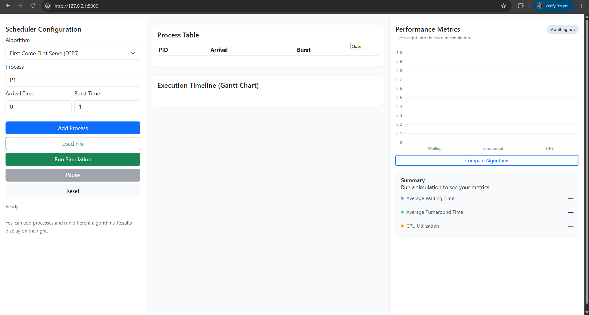
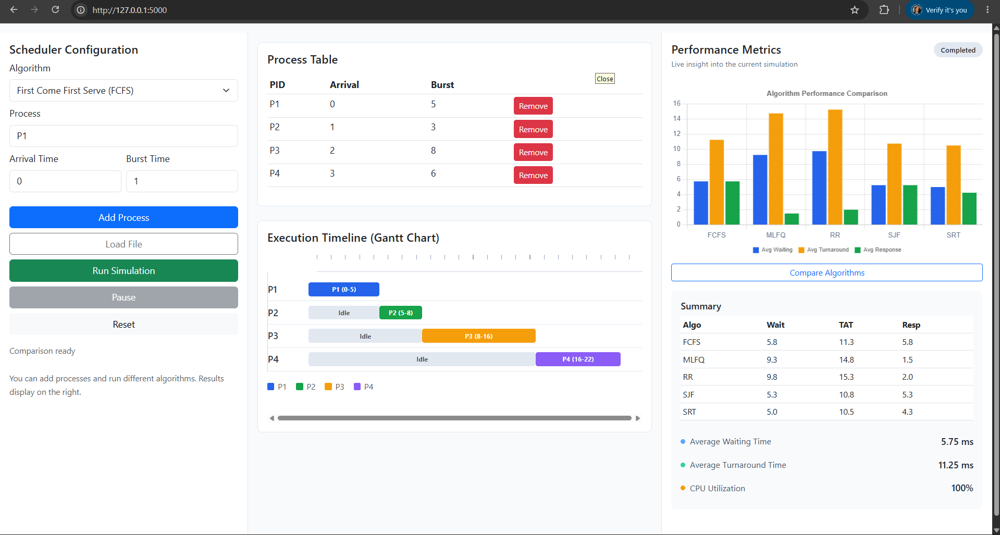

# OS CPU Scheduling Simulator — Team 5

## Team Members

| Member | Name | Student ID | Algorithm(s) |
|--------|------|------------|--------------|
| A | Kong Sonphana | p20240063 | FCFS, SJF, SRT |
| B | Chheng Sokuntheary | p20240044 | Round Robin, MLFQ |

## Setup & Installation

- Requirements: Python 3.8+, Flask

- pip install -r requirements.txt

- python main.py then open [http://127.0.0.1:5000](http://127.0.0.1:5000)

- Also works as terminal: explain how but note web UI is the primary interface

## Project Structure

```
OS-CPU-Scheduling-Team5/
├── main.py                  # Flask entry point and API routes for the web UI
├── process.py               # Process model and shared process helpers
├── display.py               # Metrics and display formatting for scheduler results
├── fcfs.py                  # First Come First Serve scheduling logic
├── sjf.py                   # Shortest Job First scheduling logic
├── srt.py                   # Shortest Remaining Time scheduling logic
├── rr.py                    # Round Robin scheduling logic
├── mlfq.py                  # Multilevel Feedback Queue scheduling logic
├── templates/
│   └── index.html           # Main dashboard layout for the web interface
├── static/
│   ├── css/
│   │   └── style.css        # Styling for the simulator dashboard
│   └── js/
│       └── app.js           # Frontend logic for interactions and rendering
├── processes.csv            # Sample CSV input file
├── processes.json           # Sample JSON input file
├── requirements.txt         # Python dependencies (Flask)
├── Todo.json                # Project metadata
├── script.md                # Notes and script outline for video presentation
└── .gitignore               # Excludes __pycache__, .venv, logs from tracking
```
## Web Interface

Describe the 3-panel dashboard:

- Left: Scheduler Configuration (algorithm selector, process input form, Load CSV/JSON button, Add Process, Run Simulation, Reset buttons)

- Center: Process Table + Gantt Chart (colored horizontal bars with time ruler)

- Right: Performance Metrics cards + Chart.js chart



## Algorithm Descriptions

One paragraph each for all 5:

### FCFS
FCFS executes processes in the order they arrive, running each one to completion without preemption. It is simple and easy to understand, but it can lead to poor performance when a long job arrives early and delays shorter jobs behind it.

### SJF (non-preemptive)
SJF selects the available process with the smallest burst time and runs it until completion. This usually reduces average waiting time compared with FCFS, but it can starve longer jobs if shorter jobs keep arriving.

### SRT (preemptive)
SRT is the preemptive version of SJF and chooses the process with the smallest remaining burst time at each time step. It often gives better turnaround time than non-preemptive SJF, but it requires more frequent context switching.

### Round Robin (quantum configurable, default 2)
Round Robin assigns each process a fixed time quantum and cycles through the ready queue, giving each process a turn in order. A smaller quantum improves responsiveness, while a larger quantum reduces overhead, and the default quantum in this simulator is 2.

### MLFQ (3 queues: Q0=RR q=2, Q1=RR q=4, Q2=FCFS, aging threshold=10 ticks)
MLFQ uses three priority queues where new processes start in Q0 and are moved to lower-priority queues as they consume CPU time. The scheduler uses Round Robin in the top two queues, FCFS in the lowest queue, and aging to prevent starvation by promoting waiting processes after 10 ticks.

## Sample Input

### Default scenario (loaded on launch)

Table: P1 arrival=0 burst=5, P2 arrival=1 burst=3, P3 arrival=2 burst=8, P4 arrival=3 burst=6

### CSV format (processes.csv)


```csv
pid,arrival,burst
P1,0,5
P2,1,3
P3,2,8
P4,3,6
```

### JSON format (processes.json)


```json
[
  {"pid": "P1", "arrival": 0, "burst": 5},
  {"pid": "P2", "arrival": 1, "burst": 3},
  {"pid": "P3", "arrival": 2, "burst": 8},
  {"pid": "P4", "arrival": 3, "burst": 6}
]
```

## Sample Output

### Comparative Analysis table (all 5 algorithms)

FCFS:  Avg WT=5.75  Avg TAT=11.25  Avg RT=5.75

SJF:   Avg WT=5.25  Avg TAT=10.75  Avg RT=5.25

SRT:   Avg WT=5.00  Avg TAT=10.50  Avg RT=4.25

RR:    Avg WT=9.75  Avg TAT=15.25  Avg RT=2.00

MLFQ:  Avg WT=9.25  Avg TAT=14.75  Avg RT=1.50



## API Routes

GET  /          serves the web UI

POST /api/run   runs single algorithm, returns gantt + metrics + averages as JSON

POST /api/compare runs all 5 algorithms, returns comparison table as JSON

## Known Limitations

- MLFQ does not preempt mid-slice

- SRT is tick-by-tick O(total_time x n)

- All tie-breaks fall back to PID order

- Web UI runs on development server only

---
